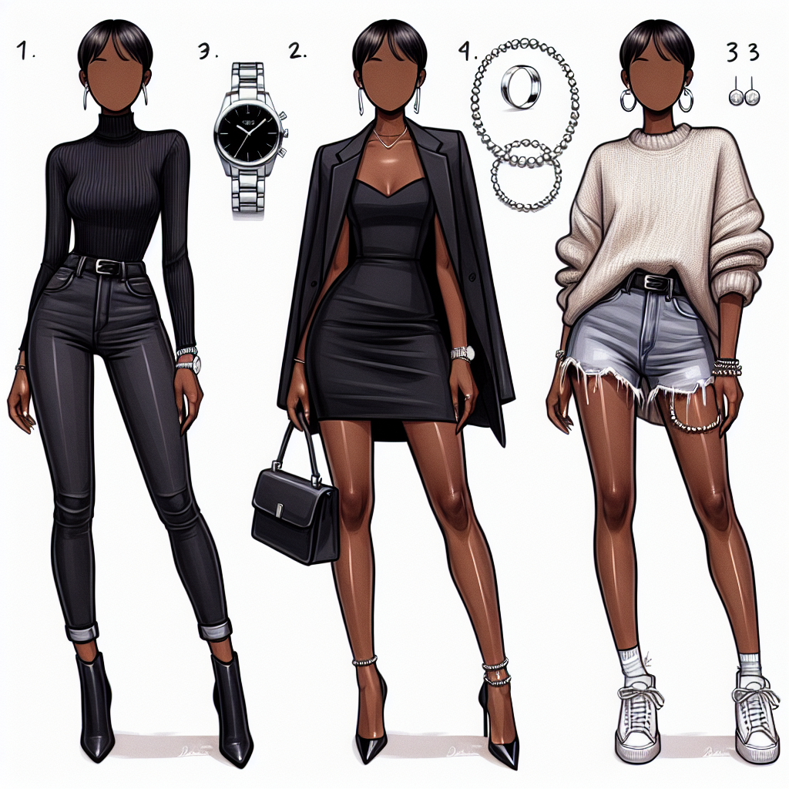

# RAG

## Project Description

Consider a fashion brand’s website where a customer can describe the item they’re looking for. Using only the images from the brand’s catalog, the site can suggest the best matches to their description.
In this project, we will create a Retrieval-Augmented Generation (RAG) system that allows customers to search for items within a fashion image dataset from a retail website. Additionally, the system will offer outfit suggestions based on the features of the items to help customers create the best possible look.
But for the search we only use the image and for the outfit suggestion we use the item attributes and the customer preferences to make a prompt and use LLM API for returning the best outfit suggestion,
We also use image generation API to generate the suggested outfit to give a better view to the customer.

## Data Encoding for the Vector Databes

We use CLIP for encoding the images and then save them in our  Qdrant Vectore Database.
Qdrant has the feature to accept the data in batch mode which increase the speed of loading the data in the dataset.
Later, the text prompt also would be encoded using CLIP model and is used for similarity matching in VD.

## Dataset 

In this project we have used [Fashion Product Images (Small) from Kaggle website](https://www.kaggle.com/datasets/paramaggarwal/fashion-product-images-small).

## Some Examples

#### Customer prompt_1
The customer prompt:  **I'm searching for a silver women watch!**

and also her body style prompt:  **I'm a black short woman.**

The item that is found in the dataset is  

#### The LLM API respond_1

A silver watch is a timeless accessory and can elevate any outfit! Here are some styling tips to help you create a chic look with a silver watch:

Outfit Idea 1: Casual Chic
- Top: A fitted black turtleneck or a white button-up.
- Bottoms: High-waisted skinny jeans or tailored trousers.
- Footwear: Ankle boots or classic loafers in black or a neutral tone.
- Accessories: Pair the watch with some delicate silver earrings and a slim bracelet for a cohesive look. 

Outfit Idea 2: Effortlessly Elegant
- Dress: A little black dress that cinches at the waist.
- Outerwear: Throw on a structured blazer or a long cardigan.
- Footwear: Pointed-toe heels or elegant flats.
- Accessories: Keep the silver watch as a statement piece and add a pair of stud earrings to complete the look.

Outfit Idea 3: Weekend Vibes
- Top: A soft oversized sweater or graphic tee.
- Bottoms: Distressed denim shorts or joggers.
- Footwear: White sneakers for comfort.
- Accessories: Layer your watch with a couple of beaded bracelets for a relaxed vibe.

**Bonus Tip**
When styling with a silver watch, consider using other metallic accessories (like a ring or a clutch) to create a cohesive look without being overbearing.

Feel free to let me know what occasion you're dressing for, and I can help refine these suggestions further!

#### The Image generated by API_1

