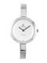

# RAG

## Project Description

Consider a fashion brand’s website where a customer can describe the item they’re looking for. Using only the images from the brand’s catalog, the site can suggest the best matches to their description.
In this project, we will create a Retrieval-Augmented Generation (RAG) system that allows customers to search for items within a fashion image dataset from a retail website. Additionally, the system will offer outfit suggestions based on the features of the items to help customers create the best possible look.
But for the search we only use the image and for the outfit suggestion we use the item attributes and the customer preferences to make a prompt and use LLM API for returning the best outfit suggestion,
We also use image generation API to generate the suggested outfit to give a better view to the customer.

## Data Encoding for the Vector Databes

We use CLIP for encoding the images and then save them in our  Qdrant Vectore Database.
Qdrant has the feature to accept the data in batch mode which increase the speed of loading the data in the dataset.
Later, the text prompt also would be encoded using CLIP model and is used for similarity matching in VD.

## Dataset 

In this project we have used [Fashion Product Images (Small) from Kaggle website](https://www.kaggle.com/datasets/paramaggarwal/fashion-product-images-small).

## Some Examples

The customer would prompt: I'm searching for a silver women watch

and also prompt her body type:  I'm a black short women

The item that is found in the dataset is  

