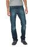
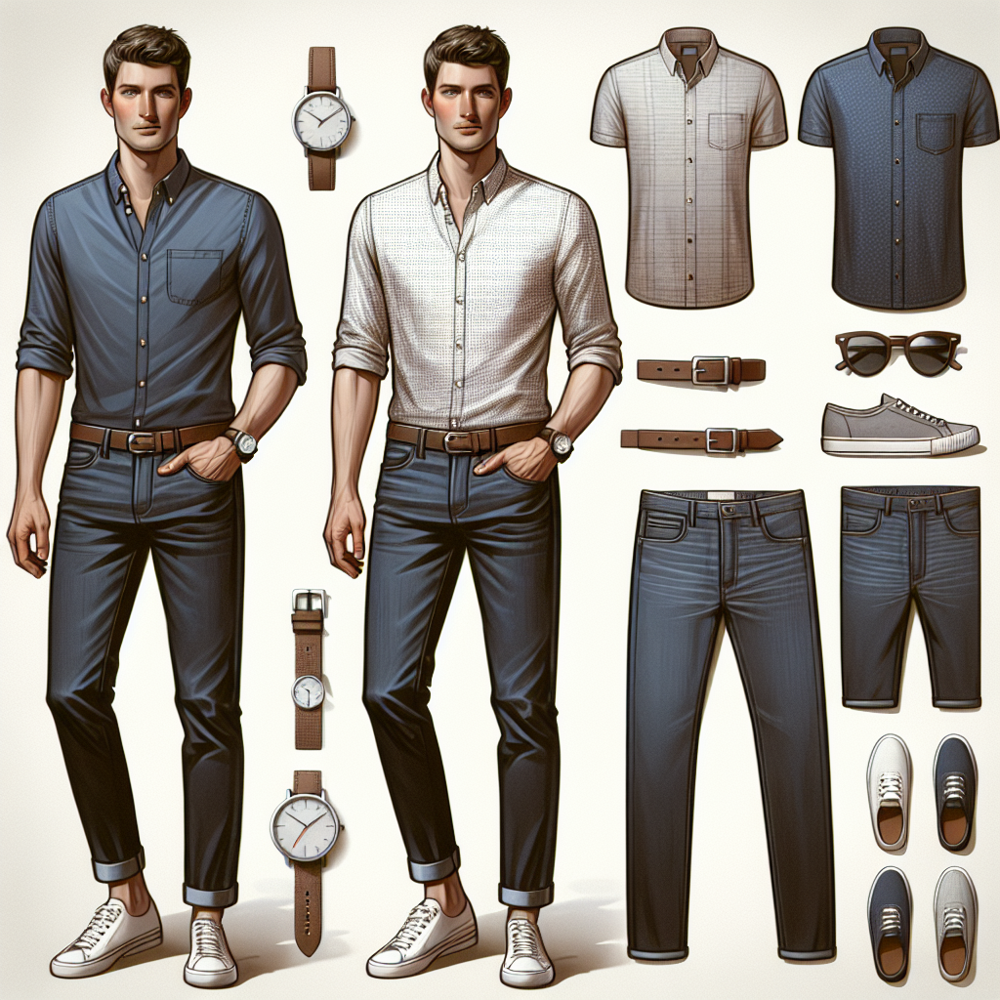

# RAG for a Fashion Website

## Project Description

Consider a fashion brand’s website where a customer can describe the item they’re looking for. Using only the images from the brand’s catalog, the site can suggest the best matches to their description.
In this project, we will create a Retrieval-Augmented Generation (RAG) system that allows customers to search for items within a fashion image dataset from a retail website. Additionally, the system will offer outfit suggestions based on the features of the items that are saved in extra CSV file to help customers create the best possible look.
For the search we only use the image and for the outfit suggestion we use the item attributes and the customer preferences to ask the LLM API for returning the best outfit suggestion,
We also use image-generator-API to generate the suggested outfits to give a better vision to the customer.

## Data Encoding for the Vector Database

We use CLIP for encoding the images and then save them in our  Qdrant Vectore Database.
Qdrant has the feature to accept the data in batch mode which increase the speed of loading the data in the dataset.
Later, the text prompt also would be encoded using CLIP model and is used for similarity matching in VD.

## Fashion Dataset 

In this project we used [Fashion Product Images (Small) from Kaggle website](https://www.kaggle.com/datasets/paramaggarwal/fashion-product-images-small). It contains 44447 images and a CSV file for the items attributes.
Build img and csv folders in the main folder of the project and download the images and styles.csv file in these two folders respectively.

## Some Examples

#### Customer prompt_1
The customer prompt:  **I'm searching for a silver women watch!**

and also her body style prompt:  **I'm a black short woman.**

The item that is found in the database is  

#### The LLM API respond_1

A silver watch is a timeless accessory and can elevate any outfit! Here are some styling tips to help you create a chic look with a silver watch:

Outfit Idea 1: Casual Chic
- Top: A fitted black turtleneck or a white button-up.
- Bottoms: High-waisted skinny jeans or tailored trousers.
- Footwear: Ankle boots or classic loafers in black or a neutral tone.
- Accessories: Pair the watch with some delicate silver earrings and a slim bracelet for a cohesive look. 

Outfit Idea 2: Effortlessly Elegant
- Dress: A little black dress that cinches at the waist.
- Outerwear: Throw on a structured blazer or a long cardigan.
- Footwear: Pointed-toe heels or elegant flats.
- Accessories: Keep the silver watch as a statement piece and add a pair of stud earrings to complete the look.

Outfit Idea 3: Weekend Vibes
- Top: A soft oversized sweater or graphic tee.
- Bottoms: Distressed denim shorts or joggers.
- Footwear: White sneakers for comfort.
- Accessories: Layer your watch with a couple of beaded bracelets for a relaxed vibe.

**Bonus Tip**
When styling with a silver watch, consider using other metallic accessories (like a ring or a clutch) to create a cohesive look without being overbearing.

Feel free to let me know what occasion you're dressing for, and I can help refine these suggestions further!

#### The Image generated by API_1

#### Customer prompt_2
The customer prompt:  **I'm searching for a men summer jean!**

and also his body style prompt:  **I'm a white tall man.**

The item that is found in the database is  

#### The LLM API respond_2
Great choice! For a summer outfit featuring blue jeans, here's a stylish pairing:

Outfit Idea:
- Jeans: Peter England Men Party Blue Jeans (or any slim-fit dark blue or light wash jeans)
  
Top:
- Shirt: A lightweight, short-sleeve button-up shirt in a light color like white, pale blue, or pastel shades. A subtle pattern like checks or stripes can add character.

Footwear:
- Shoes: White sneakers or casual loafers will keep the look fresh and comfortable for summer.

Accessories:
- Watch: A classic leather or canvas strap watch.
- Sunglasses: A pair of trendy sunglasses for sun protection and style.
- Belt: A brown or navy leather belt to match your footwear.

Optional Layer:
- If it gets cool in the evening, consider adding a light denim jacket or a casual blazer to elevate the look.

This outfit is not only stylish but also comfortable for a summer outing. Enjoy your summer!

#### The Image generated by API_2

## Future Features

The provided results by the image generator api does not look a like the serached item, in the next version we can finetune our image generator with the methods like [DreamBooth](https://dreambooth.github.io/
) with few examples of retrieved item, and then can produce more related generated images.

# How to Run the Code!

### Install the dependencies

Create the virtual environment and install the dependencies:

python3 -m venv .venv
source .venv/bin/activate
.venv/bin/pip install -r requirements.txt

### Run
Run the notebook (RAG.ipynb) cells one by one

